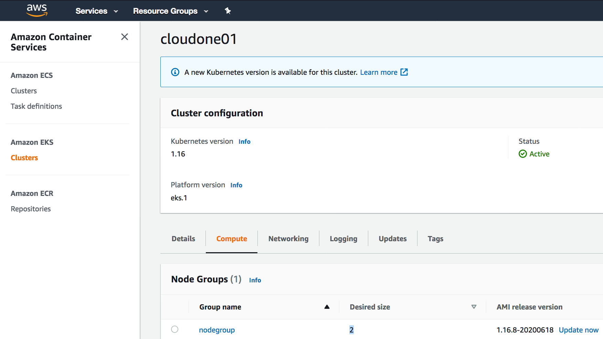
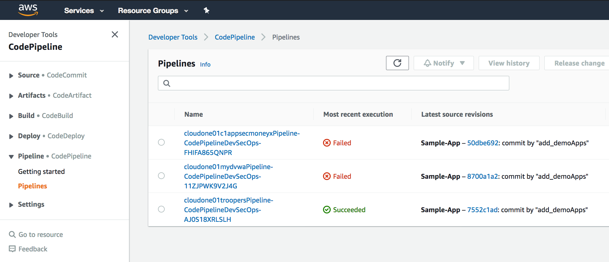
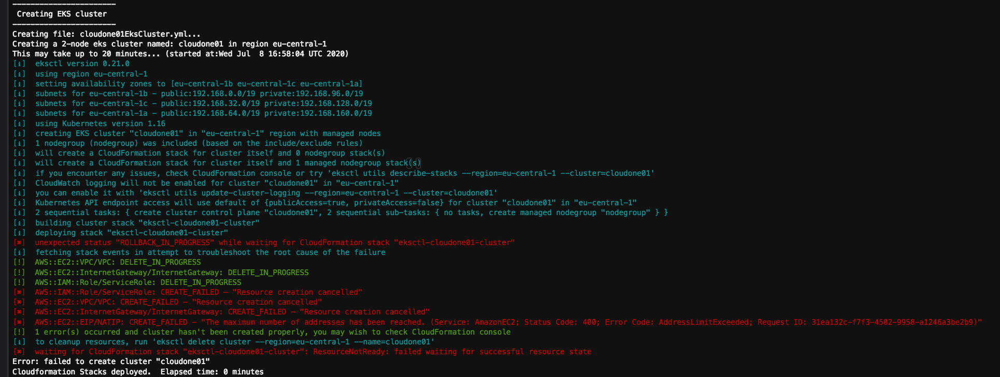

# Overview
This is a collaborative effort with mawinkler and nicgoth   
In short, the script in this repo sets up:
- an AWS Elastic Kubernetes Service Cluster (EKS)
- an AWS codeCommit registry
- three AWS codePipelines
- Trend Micro Cloud One Container Registry Security (C1CS or "SmartCheck") and integrates it in the pipelines

Then it will:
- build 3 containers and
- scan them for vulnerabilities, malware, sensitive content etc..
- and, if the risk is below the defined threshold:
    - push them to the ECR registry
    - deploy them on AKS

This README.md describes how to deploy the demo environment

Checkout the **howToDemo.md** for demo scenarios

# High level overview of steps (see detailed steps in next section)
1. open Cloud9, configure AWS CLI with your keys and region and clone this repo
2. enter your settings in `00_define_vars.sh`
3. run  . ./up.sh to deploy the environment (mind the extra dot which is needed to "source" the vars from the script)
4. see [howToDemo.md](howToDemo.md) for demo scenarios
5. run ./down.sh to tear everything down

# Detailed setup instructions

## Requirements       -----DO READ-----
**Shared AWS Accounts**   <br/>
If you share an AWS account with a co-worker, make sure that:
- you both use **different regions**
- you both use different project names and that project name is not a subset of the other one: eg cloudone and cloudone01 would be bad, but cloudone01 and cloudone02 would be fine  (I know... there is room for improvement here)

The AWS Region that you will use must have:
- **one "free" VPC "slot"**
   By default, there is a soft limit of 5 VPCs per region.  This script must be able to create 1 VPC
- **one "free" Elastic IP "slot"**
   By default, there is a soft limit of 5 Elastic IPs per region.  This script must be able to create 1 Elastic IP
- **one "free" Internet Gateway "slot"**
   By default, there is a soft limit of 5 Internet Gateways per region.  This script must be able to create 1 Internet Gateway

The Cloud Formation Template to build the EKS cluster will crash if those resources cannot be created

The IAM User account that you will use:
- must have **Programmatic Access** as well as **AWS Management Console Access**
- must have **AdministratorAccess** permissions (AWS console -> Services -> IAM -> Users -> click on the user -> Permissions tab -> If AdministratorAccess is not there, then click on Add permissions and add it; or request the rights from you Admin)  The reason is that the script will not only create an EKS cluster, but also a lot of other things, like create  VPC, subnets, routetables, roles, IPs, S3 buckets, ...

(trial) Licenses:
- **A license for Cloud One Container Image Security** (aka SmartCheck) If you don't have a license key yet, you can get one here: https://www.trendmicro.com/product_trials/download/index/us/168 <br />
- **CloudOne Application Security Account**  You can register for a trial here: https://cloudone.trendmicro.com/_workload_iframe//SignUp.screen  You will need to create a "group" for the MoneyX application.  This will give you a **key** and a **secret** that you can use for the TREND_AP_KEY and TREND_AP_SECRET variables in this script.<br />

## Preparation  
1. Setup an AWS Cloud9 development environment
  - select `Create a new EC2 instance for environment (direct access)`
  - use `t2.micro`
  - use **Ubuntu Server 18.04 LTS**
  - tag it to your liking (tags are good)
  - use default settings for the rest

<!--0. <not needed?>
Create an AWS Role to allow the EKS worker nodes (EC2 instances) to connect to ECR  
 - AWS Services -> IAM -> Roles -> Create Role
 - Select type of trusted entity: AWS Services
 - Choose a use case: EC2 -> Next: Permissions
 - Assign permission policy : "AmazonEC2ContainerRegistryFullAccess" -> Next: Tags
 - -> Next Role name: e.g. project_name_EC2_access_to_ECR  
  -->

<!-- 0. Grant the Cloud9 environment Administrator Access <br />
- Click the following deep to create the Role for Cloud9:
https://console.aws.amazon.com/iam/home#/roles$new?step=review&commonUseCase=EC2%2BEC2&selectedUseCase=EC2&policies=arn:aws:iam::aws:policy%2FAdministratorAccess

- Name it Cloud9EC2AdminAccess
- Attach the IAM role Cloud9EC2AdminAccess to the ec2 instance of your Cloud9:
  * In the AWS Console, go to Services -> EC2 -> select the EC2 instance used for this Cloud9 -> Actions -> Instance Settings -> Attach/Replace IAM Role
* Within Cloud9 Preferences -> AWS Settings -> Credentials -> AWS managed temporary credentials -> Disable
-->

2. In Cloud9, disable the `AWS-managed temporary credentials`  
Click on the AWS Cloud9 tab in the Cloud9 menu bar.  The tab may also show as a cloud with a number 9 in it.  If you don't see the menu bar as indicated in the screenshot below, hover the mouse over the top of the window. The menu bar should roll down and become visible.  Go to -> Preferences (see "1") -> scroll down and expand "AWS Settings" (see "2")-> Credentials -> uncheck "AWS managed temporary credentials"  (see "3")   


3. configure AWS cli
```
$ aws configure
AWS Access Key ID [****************GT7G]:   type your AWS Access Key here
AWS Secret Access Key [****************0LQy]:  type your AWS Secret Access key here
Default region name [eu-central-1]:    Configure your region here
Default output format [json]:          Set default output to JSON
```
<!--4. Create credentials for CodeCommit  
CodeCommit requires AWS Key Management Service. If you are using an existing IAM user, make sure there are no policies attached to the user that expressly deny the AWS KMS actions required by CodeCommit. For more information, see AWS KMS and encryption. <br />
- In the AWS console, go to Services and choose IAM, then go to Users, and then click on the IAM user you want to configure for CodeCommit access.<br />
- On the Permissions tab, choose Add Permissions.
- In Grant permissions, choose Attach existing policies directly.<br />
- From the list of policies, select AWSCodeCommitPowerUser or another managed policy for CodeCommit access.<br />
- Click "Next: Review" to review the list of policies to attach to the IAM user.<br />
- If the list is correct, choose Add permissions.

see also:
https://docs.aws.amazon.com/codecommit/latest/userguide/setting-up-gc.html?icmpid=docs_acc_console_connect_np
-->
3. Get a trial account for Trend Micro Cloud One Container Security (aka Deep Security Smart Check).  
This will provide pre-runtime scanning of containers.
see: https://github.com/deep-security/smartcheck-helm

4. Get a trial account for Trend Micro Cloud One Application Security.  
This will provide runtime protection to the containers.

##  Clone this repo:
In your Cloud9 environment, run the following command to clone this repository:
```
git clone https://github.com/cvdabbeele/cloudOneOnAWS.git
cd cloudOneOnAWS
```
## Define variables for AWS, Cloud One Container Security and for Cloud One Application Security
Copy 00_define_vars.sh.sample to 00_define_vars.sh
```
cp 00_define_vars.sh.sample 00_define_vars.sh
```
Edit the 00_define_vars.sh file (e.g. by using vi)  <br />
Enter your own configuration variables in the config file
```
vi 00_define_vars.sh.sample
```

## Deploy the environment

```
$ . ./up.sh
```
This will do the following:  <BR /> <sup>
(PS: there is a "Common Issues" section at the end of this document)</sup>

1. Create an EKS cluster
 <br />
 <br />

2. Install Smart Check with internal registry
 <br />

3. Add the internal Repository plus a demo Repository to Smart Check
 <br />

4. Setup demo pipelines
 <br />

5. git-clone 3 demo applications <br />
At the same level as the project directory (cloudOneOnAWS), an "apps" directory will be created.

Hereunder, 3 app-repos will be git-cloned from the public github (**c1appsecmoneyx, troopers and mydvwa**)  <br />

6. Those apps will be pushed to the AWS CodeCommit repository of the project
 <br />

7. This will trigger an AWS CodeBuild process to build the applications

By default:
- the **troopers** app will be deployed because it is clean
- the **c1-app-sec-moneyx** and the **mydvwa** apps will not be deployed because they have too many vulnerabilities

<br /><br />

8. And it will have the images scanned by SmartCheck before they are pushed to the internal ECR repository of the Project.

8. If the risk is below the defined threshold (as set in the codebuild.yaml file), the images will be pushed to the ECR

9. And they will be deployed on the EKS cluster of the Project

If you encounter any **errors**, please check the "common issues" section at the bottom


### Demo Scenario##
For the demo scenario, see [howToDemo.md](howToDemo.md) <br />

<br /><br />
## Suspend / Tear down
```
$ ./down.sh
```
Unfortunately it is (currently) not possible to *suspend* the environment.
- One cannot set the number of EKS nodes to 0.  
- Also if we top an EKS worker node (which is an E2 instance) then EKS spins up a new one because we have set a required minimum number of nodes.  

To avoid excessive costs when not using the demo environment, tear-down the environment.  The ./down.sh script will delete the EKS cluster, the EC2 instances, Cloudformation Stacks, Roles, VPCs, Subnets, S3buckets,....  <br/>
The Cloud9 EC2 instance will stop, but remain available for later.  

To start the enviroment again, simply reconnect to the Cloud9 environment and run **./up.sh**  This will redeploy everything from scratch


## Common issues (WIP)
### Error: Kubernetes cluster unreachable
`The connection to the server localhost:8080 was refused - did you specify the right host or port?`

Verify your AWS_PROJECT variable. It may only contain **lowercase and trailing numbers**, but :
- no uppercase
- no " - "
- no " _ "
- nor any special characters

This variable is used for several purposes and each of them have their own restrictions,..which add up to "only a-z lowercase and numbers"  It may also not begin with a number.

### Error Code: AddressLimitExceeded

<br />
  Ensure that you can create Elastic IPs in this region.  <br />
  By default, there is a (soft) limit of 5 Elastic IPs per AWS region

## Error


## Next Step
Checkout [howToDemo.md](howToDemo.md) <br />
**howToDemo.md** for a few typical demo scenarios
